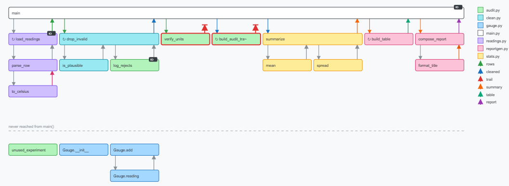

# CSD — Codebase Sink Diagram

**A static analysis tool that draws a Python package so that structurally useless code is visually obvious.**

Dead code hides in a diff. It can't hide in a picture where every value has to visibly land somewhere.

CSD reads a package with `ast`, works out where each function's return value actually *goes*, and renders the result as an SVG that reads like **a successful run of the program** — an icicle chart of the call tree. The entry point is a bar spanning the whole run; everything it calls sits inside it; their callees sit inside them. A bar's width is how much of the program that function is solely responsible for.

Each bar is that function's own execution, left to right: a call arrives at its start carrying an argument, and the return leaves from its end. Both arrows are coloured by the value they carry, so you can follow one variable down into a call and back out again. A value nobody consumes never makes it home: its return stops short in a red stub.

No LLM calls. No network. No heuristics that require judgment. Everything is derived deterministically from the AST — and anything that *can't* be resolved statically is counted and reported, never guessed.


---

## Contents

- [The honesty counter](#the-honesty-counter)
- [Requirements](#requirements)
- [Usage](#usage)
- [Reading the diagram](#reading-the-diagram)
- [What makes a node "dead"](#what-makes-a-node-dead)
- [graph.json](#graphjson)
- [What this tool refuses to do](#what-this-tool-refuses-to-do)
- [Architecture](#architecture)
- [Specimens](#specimens)
- [Development](#development)
- [Known rough edges](#known-rough-edges)

---

## The honesty counter

`analyze` prints exactly three lines, and nothing else:

```
resolved 17
unresolved_dynamic 20
external 16
```

Every single `ast.Call` node in the package lands in exactly one of those three buckets, and the three numbers are asserted to sum to the total call count. This is deliberate and it is the most important output of the tool.

A diagram built on 60% of the edges is a diagram that lies. If a large share of your calls are `unresolved_dynamic`, the picture is telling you less than it appears to — and now you know that, instead of being quietly misled.

## Requirements

Python 3 and nothing else. No dependencies, no install step, no virtualenv required.

Developed and tested on CPython 3.12. The code targets 3.8+, but only 3.12 is exercised by the test suite. Note that the parser is your own interpreter — to analyze a package containing `match` statements you need 3.10+.

## Usage

Two subcommands with a JSON file between them:

```bash
python -m csd analyze <package_path> -o graph.json
```

```bash
python -m csd render graph.json -o diagram.svg
```

| Flag | Applies to | Meaning |
|---|---|---|
| `-o`, `--output` | both | Output path (required) |
| `--entry` | `analyze` | Fully-qualified id of the entry function, e.g. `pkg.main.main` |
| `--exclude` | `analyze` | Skip paths matching a glob; repeatable. Matches a package-relative path or a bare name, so `vendor`, `vendor/*` and `*_pb2.py` all work |

Every `.py` file under the package must parse, so a single vendored Python 2 file
would otherwise stop the run — `--exclude vendor` is the way out. Whatever a
`--exclude` skipped is reported on stderr; stdout stays exactly the three counters.

**Entry point discovery**, in precedence order: `--entry` if given → a single function named `main()` → the body of an `if __name__ == "__main__":` guard. If none of these resolve — or if several `main()`s exist — it fails loudly rather than picking one.

Errors print as `csd: error: <message>` on stderr with exit code 1. `analyze` writes nothing to stdout but the three counters; `render` is silent on success.

## Reading the diagram


| Element | Meaning |
|---|---|
| **Y position** | **Depth along this call path** — the entry point is 0, what it calls is 1, what *those* call is 2. Because a bar is drawn once per path that reaches it, every bar sits directly under the bar that called it. |
| **Bar width** | Everything that happens inside that call: the bar covers all of its callees, which cover theirs. A leaf is one column; the entry point spans the run. Width is a slop metric in itself: a wide bar whose value nobody uses is a lot of program doing nothing. |
| **X position** | Call order, depth-first, so each subtree sits contiguously to the right of its parent and the diagram reads left to right like an execution trace. |
| **Bar inside a bar** | The call itself. No arrow is needed to say it. |
| **The same function drawn twice** | Two calls to it, on two different paths — the same function running twice, which is what happens at runtime. A helper called from three places is three bars, each inside its caller, so no arrow ever travels sideways to find a shared helper. The cost is repetition: a shared subtree is duplicated whole, so heavy fan-in makes a wide picture. |
| **Arrow down (call)** | A call — one per call site, always drawn, dropping straight into the **start** of its callee's bar. Coloured by the argument it carries in; grey when the analyzer can't name what's passed (a literal, or a value computed inline). |
| **Arrow up (return)** | The value that call returned, leaving from the **end** of the callee's bar — where the return actually happens — and going straight back up into the caller that asked for it, coloured per variable. |
| **Dashed purple arrow** | Recursion — a call back into a function already open on this path. A self-call arcs out of a bar and straight back into it; mutual recursion arcs up to the partner it re-enters. |
| **Red stub** | A return that never reaches its caller: the value was discarded. Paired with a red outline on the node that produced it. |
| **No return arrow** | The function returns nothing — a pure side-effect call. |
| **↻ marker** | The function's own body contains a `for`/`while` loop. |
| **`IO` badge** | The function directly touches `open`, `print`, `input`, `sys.argv/stdin/stdout/stderr`, `os.environ`, a called `.read()`/`.write()`, `socket`, or `subprocess`. A field that merely happens to be *named* `read` is not I/O. |
| **Band below the dashed rule** | Functions never reached from the entry point, laid out the same way from their own roots. Present in the diagram, but not part of the run. |
| **Legends** | Module colors to the right, then the values that pass through the entry function. Wraps into as many columns as it needs, and every module gets its own colour however many there are. |

Every bar has exactly one caller, which is what keeps the invariant that a caller is *always* drawn directly above the function it calls. Recursion is the one call this cannot express — a function cannot be drawn inside itself — so a call back into a function already open on the path stays an explicit dashed back edge.

## What makes a node "dead"

A node gets the red outline when **all four** of these hold:

1. it returns a value on some path, **and**
2. that value is consumed nowhere, **and**
3. the function's own body performs no direct I/O, **and**
4. it is actually called from a function (unreached code is never flagged — the tool won't accuse what it hasn't traced).

Condition 3 is why a function whose result is discarded but which `print`s stays green: the call still has an observable effect, so discarding its return isn't pointless.

**Red means "interrogate," not "delete."** Two honest false positives exist by construction:

- **In-place mutation.** A function that mutates its argument *and* returns it will look dead if the caller ignores the return value, even though the mutation is load-bearing.
- **Raise-as-gate validators.** A validator that raises on bad input and returns a value otherwise is fine to call for effect — but the analyzer tracks values, not exceptions, so it glows red.

Both are cheap to check by eye, and neither is guessed away.

## graph.json

The analyze/render boundary. Layout-free by design: it describes the program, never pixels, so other consumers (an editor extension, a CI check) can use the same file.

```jsonc
{
  "meta": {
    "tool_version": "0.5.0",
    "entry_point": "pkg.main.main",
    "resolution": { "resolved": 17, "unresolved_dynamic": 20, "external": 16 },
    "entry_locals": [                       // main's tracked locals, in bind order
      { "var": "rows", "producer": "pkg.ingest.load", "status": "consumed" },
      { "var": "trail", "producer": "pkg.audit.build", "status": "discarded" }
    ]
  },
  "nodes": [{
    "id": "pkg.util.compute_checksum",      // module-qualified, unique
    "qualname": "compute_checksum",         // dotted within the module (Class.method)
    "module": "pkg.util",
    "file": "pkg/util.py",
    "lines": [12, 18],                      // [first, last]
    "params": ["records"],
    "call_order": 7,
    "has_io": false,
    "has_loop": true,
    "returns_value": true,
    "is_terminal": true,                    // some call site discards its result
    "is_dead": true
  }],
  "call_edges":     [{ "caller": "...", "callee": "...", "line": 14 }],
  "dataflow_edges": [{ "producer": "...", "consumer": "...", "var": "rows",
                       "line": 14, "consumed_by": "call" }]
}
```

`consumed_by` is one of `call` (passed to a resolved call), `external_call` (read by a stdlib/third-party call), or `return` (returned from the enclosing function). Output is deterministic — same input, byte-identical JSON — and a committed golden file locks it.

## What this tool refuses to do

This list is the point of the tool, not an apology for it.

- **Dynamic dispatch is never guessed.** `getattr`, functions passed as arguments, dict-based dispatch tables, decorators that replace the callee, monkeypatching, and inherited-method calls via `self` all land in `unresolved_dynamic` and are counted in the number you see printed.
- **Bare names resolve by Python's own scope rules, and no further.** A call to a nested function resolves against its enclosing function scopes, innermost first, then module scope. A class body is *not* a scope: a bare `helper()` inside a method never binds to a sibling method, because at runtime it wouldn't either. What the analyzer still can't see is rebinding — a local that shadows a module-level function name resolves to the function.
- **Recursion is drawn, not resolved.** A call back into a function already open on the current path is a *back edge*: it's drawn as a dashed purple arrow, but it can't set depth, because a function cannot sit below itself. The tree layers over forward calls only.
- **Deadness is one hop.** A function whose only consumer is itself dead is *not* transitively flagged yet.
- **Module-level scope isn't dataflow-analyzed**, so a value consumed at module level (`CONFIG = load_config()`) can't be proven dead — and is therefore never flagged. Conservative on purpose.
- **`params` records plain positional parameters only** — `*args`, `**kwargs`, keyword-only, and positional-only (before a `/`) parameters are omitted from the JSON. They don't affect the diagram.
- **One name, one function.** When a module defines the same name twice — platform branches, an import fallback — the *first* definition is kept, which is the default configuration, and the redefinition is reported on stderr. `@overload` stubs are skipped entirely, so the real implementation is the one analyzed.
- **Nothing is silently dropped.** If it can't be resolved, it gets counted as unresolved. That's the whole contract.

## Architecture

One module per pipeline stage, standard library only:

```
csd/
  schema.py      # graph.json data model + CsdError — the ONLY shared module
  symbols.py     # 1a  symbol table (qualnames, spans, params, loops, returns)
  callgraph.py   # 1b  call resolution + the three bucket counters
  callorder.py   # 1c  entry discovery + DFS call order (cycles raise)
  dataflow.py    # 1d  consumption analysis — the core
  iotags.py      # 1e  direct I/O tagging (IO_MARKERS is the one config constant)
  deadness.py    # 1f  one-hop deadness
  layout.py      # 2a  LayoutStrategy interface + CallTreeLayout
  render.py      # 2b  hand-emitted SVG (no graph/layout libraries)
  cli.py         # the two subcommands
```

**The analyze/render seam is real.** `layout.py` and `render.py` import from `schema.py` and nothing else. The render side literally cannot read your source code; it only ever sees the JSON. (Verify it yourself: import only `csd.schema`, `csd.layout`, `csd.render`, load a `graph.json`, and render it with zero analysis modules loaded.)

**Alternative layouts are a drop-in.** `LayoutStrategy.layout(graph) -> Layout` takes the graph and returns bars plus the arrows between them: `Layout.slots` maps an instance key (`pkg.m.helper#2`) to a `Slot`, and `Layout.edges` lists the `DrawEdge`s already resolved to instances. Drawing a function more than once is therefore a layout decision, not a rendering one — `CallTreeLayout` is one implementation, and a new strategy gets the `Graph` and nothing else, so it can't cheat by re-reading source.

## Specimens

`specimen/` is a small transaction categorizer with one planted dead function (`compute_checksum` — a checksum computed and immediately discarded). It's the acceptance subject for the test suite and its full analysis output is locked by `tests/golden/specimen_graph.json`.

```bash
python -m csd analyze specimen -o graph.json && python -m csd render graph.json -o diagram.svg
```

`showcase/` is the larger subject: a static-site builder written so that its natural structure exercises **every** feature of the tool at once. The committed render lives at `docs/showcase/diagram.svg`.

```bash
python -m csd analyze showcase --exclude vendor -o docs/showcase/graph.json
```

```bash
python -m csd render docs/showcase/graph.json -o docs/showcase/diagram.svg
```

| In the picture | Where it comes from |
|---|---|
| Dashed self-recursion | `discover.walk_tree` recursing into subdirectories |
| Dashed mutual recursion | `parse.parse_block` ⇄ `parse.parse_inline` |
| Red stub + red outline | `audit.compute_checksum`, plus the two documented false positives beside it — `normalize_headings` (mutates in place) and `validate_pages` (raise-as-gate) |
| Red legend entry | `integrity`, the only entry local nothing reads |
| No return arrow | `publish.publish_site`, a pure side effect |
| `IO` badge | `config.load_config`, `discover.read_page`, `publish.write_page`, `theme.loader.load_shell` — and pointedly *not* `audit.record_size`, whose `stats.read`/`stats.write` are counters |
| The same helper drawn three times | `text.slugify`, called from three places — one bar inside each caller, instead of three arrows converging on one |
| Unreached band with real structure | `legacy.py`'s feed exporters, and the `Template` class — whose `self.slot()` call resolves while `template.render()` never can |
| A third of calls unresolved | `plugins.py` dispatches through a table, a `getattr`, and a callback parameter; the rest are method calls on values whose type isn't knowable statically |
| Nothing at all | `vendor/legacy_py2.py`, which `--exclude` skipped and stderr reported |

`compat.py` is defined twice on purpose — one `default_encoding` per platform — so `analyze` prints its redefinition warning to stderr while still producing a graph.

**`tests/test_showcase.py` asserts every row of that table.** The claim that this package showcases the whole tool is enforced, not aspirational: if a change stops drawing recursion or stops flagging deadness, a test fails.

## Development

```bash
python -m unittest -v
```

144 tests, `unittest` only — no pytest, no plugins. Coverage includes per-stage unit tests on inline source fixtures, an invariant test asserting the three counters sum to the total `ast.Call` count, a golden-file regression on the whole analyze output, and structural assertions on the emitted SVG (element counts, the dead node's identity, no overlapping value lanes).

## Known rough edges

Honest v1 limitations, none of which affect the specimens:

- **Repetition is the price of straight arrows.** Drawing a function once per call path is what removes every sideways arrow, but a shared subtree is duplicated whole. Most packages barely notice (139 functions → 147 bars); a graph with heavy fan-in does not (174 functions → 876 bars, a 64,000px-wide image). Such a picture wants pan/zoom rather than a static file.
- **One return arrow per call site.** A caller that calls the same helper twice gets two arrows into the one bar. Correct, but busy.
- **`is_terminal`** is also set for functions with no return value whose call result is discarded, which is a slight drift from the field's stated meaning. JSON-only; it doesn't affect rendering. The same field also fires when one variable is bound in both arms of an `if`/`else`: the first binding reads as never consumed.
- **A package whose only entry is an `if __name__ == "__main__":` guard analyzes but does not render.** The guard becomes the pseudo-entry `pkg.mod.__main__`, which is not a real node, and the call tree has nothing to root itself on. Pass `--entry`, or define `main()`.

---

Built as a rough first version, deliberately: it prefers crashing loudly over quietly handling an edge case.
